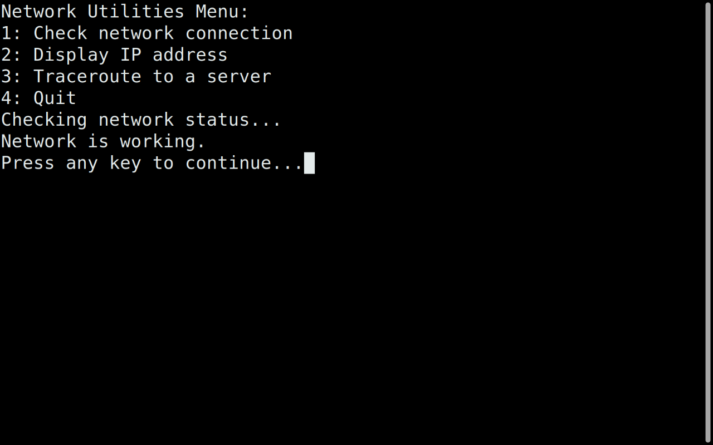
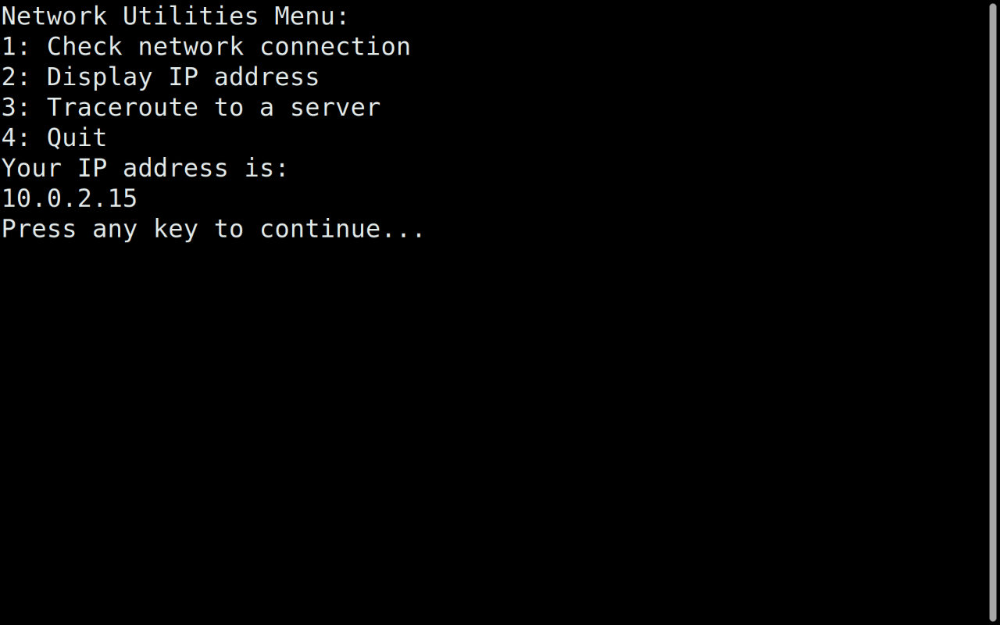
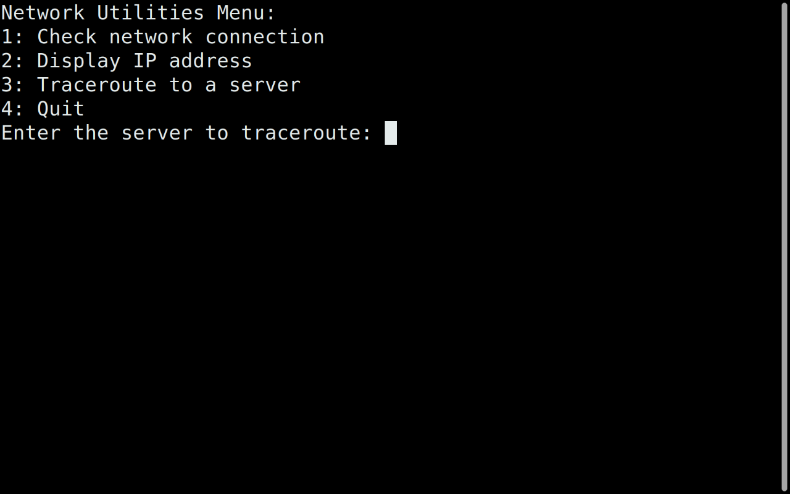
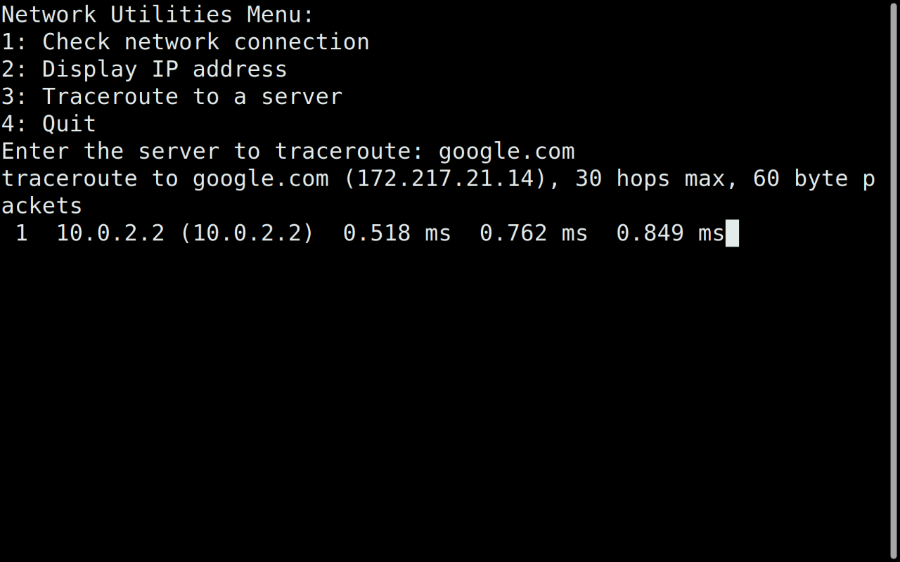

# Network Utilities Script

This script provides a set of basic network utilities to check network status, display the IP address, and perform a traceroute to a server.

## Features
- **Check Network Connection**: Verifies network connectivity by pinging `google.com`.
- **Display IP Address**: Retrieves and displays the machine's IP address. If the `ip` command is not installed, it will prompt to install `iproute2`.
- **Traceroute to a Server**: Performs a traceroute to a specified server. If the `traceroute` command is not installed, it will prompt to install it.

## Prerequisites
- The following commands should be installed on your system:
    - `ping`
    - `ip` (from the `iproute2` package)
    - `traceroute`

To install missing dependencies on Ubuntu/Debian:
```bash
sudo apt install iproute2 traceroute





